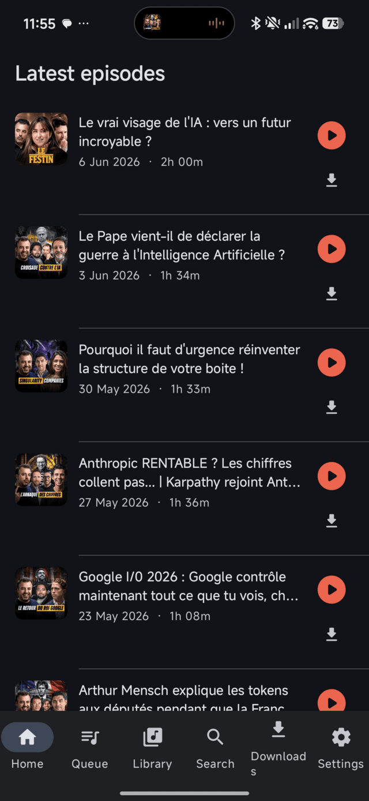
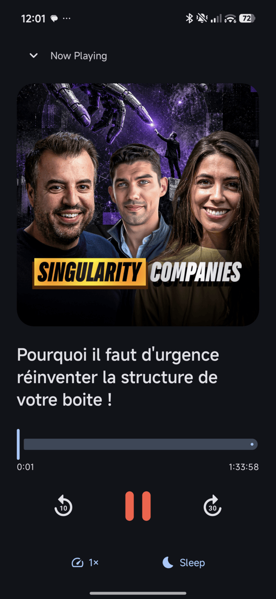
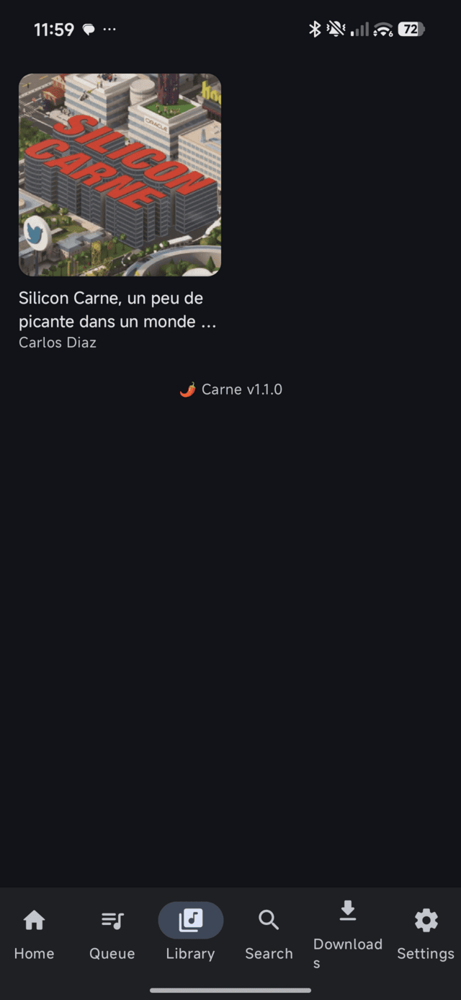
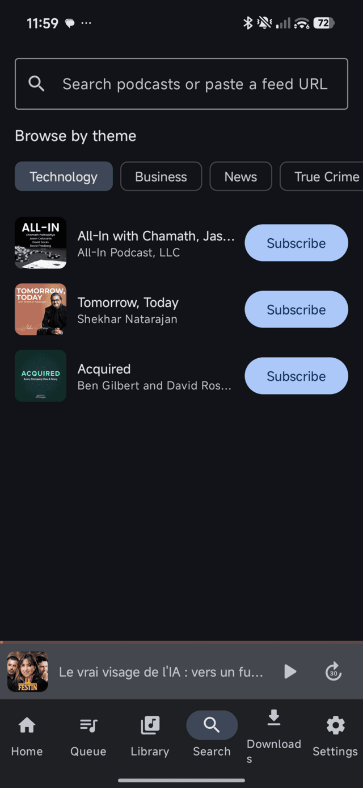
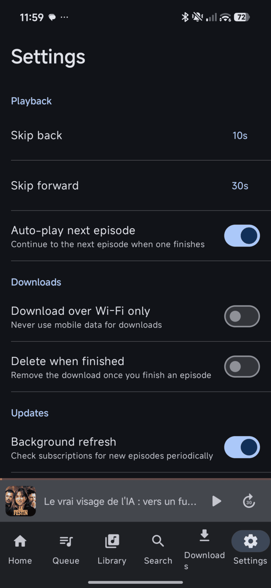

# 🌶️ Carne — a modern Android podcast player

A clean, ad-free, tracker-free podcast player for Android. Built to install
directly on your phone (sideload the APK — no Play Store, no account).

Your favorite show, **[Silicon Carne](https://siliconcarne.substack.com/)** by
Carlos Diaz, is pre-subscribed on first launch.

## Screenshots

<p align="center">
  
  
  
  
  
</p>

## Features

- 🎧 **Background playback** with lock-screen & notification controls (Media3 / ExoPlayer + MediaSession)
- 🚗 **Android Auto** — browse Continue listening / Subscriptions / Downloads and play hands-free in the car
- ⏯️ Play / pause, **configurable skip intervals**, scrub
- ▶️ **Auto-play the next episode** — continuous playback through your list
- ⏩ **Variable speed** (0.8×–3×), remembered as your default
- 🤫 **Skip silence** & **volume boost** for clearer speech over road/train noise
- 🔖 **Chapters** — tap to jump (Podcasting 2.0 `podcast:chapters`)
- 📝 **Rich show notes** — formatted HTML with tappable links & `mm:ss` timestamps that seek
- 😴 **Sleep timer** — fixed durations or **stop at end of episode**
- 💾 **Offline downloads** (WorkManager — survives app being closed), optional **Wi-Fi-only** and **auto-delete when finished**
- 🔄 **Background refresh + new-episode notifications** for your subscriptions
- 🔖 **Resume where you left off** — playback positions saved per episode
- ✅ Auto mark-as-played, "Continue listening" on the home screen
- 🔍 **Discover** podcasts (iTunes search) or paste any RSS feed URL
- 📚 Subscriptions library with pull-to-refresh
- 🧾 **Up-Next queue** — a persistent, reorderable play queue ("Play next" / "Add to queue")
- 💼 **Own your data** — OPML import/export and a full local backup/restore (subscriptions, progress & settings), all on-device
- 🌍 **Localized** — English & French (`fr`)
- ⚙️ **Settings** for playback, downloads, updates, your data and appearance
- 🎨 **Material You** dynamic theming, light/dark/system theme, edge-to-edge
- 🚫 No ads, no analytics, no login

## Tech stack

| Concern        | Choice |
|----------------|--------|
| Language       | Kotlin 2.0 |
| UI             | Jetpack Compose + Material 3 |
| Playback       | AndroidX **Media3** (ExoPlayer + Session) |
| Persistence    | **Room** |
| DI             | **Hilt** |
| Async          | Coroutines + Flow |
| Background work| WorkManager |
| Networking     | OkHttp + platform XmlPullParser (RSS) |
| Images         | Coil |

`minSdk 26` (Android 8.0) · `targetSdk 35` · single-activity, MVVM.

## Get the APK on your phone

**Easiest — from CI:** every push builds an installable APK.
1. Open the repo's **Actions** tab → latest **Build APK** run.
2. Download the **`carne-release-apk`** artifact and unzip it.
3. Copy `app-release.apk` to your phone, tap it, allow *install from unknown
   sources*, install.

   (When building from `main`, the same APKs are also attached to the rolling
   **`latest`** GitHub Release for a one-tap download on the phone.)

**Build it yourself:**
```bash
./gradlew assembleRelease
# → app/build/outputs/apk/release/app-release.apk
```
Requires JDK 17 and the Android SDK (platform 35). The release build is signed
with the local debug key so it installs without extra setup — swap in your own
keystore in `app/build.gradle.kts` for store distribution.

## Project layout

```
app/src/main/java/com/carne/podcast/
├─ data/        Room (local) · RSS + iTunes (remote) · repository · settings (DataStore) · opml + backup (data ownership)
├─ playback/    Media3 service, controller bridge, sleep timer
├─ download/    WorkManager episode downloader
├─ sync/        Periodic feed refresh worker + new-episode notifications
├─ ui/          Compose screens, theme, navigation, components
├─ di/          Hilt modules
├─ CarneApp     Application — seeds Silicon Carne on first run
└─ MainActivity
```

## Notes

- Silicon Carne feed: `https://feed.ausha.co/vVW80F6lQwAm` (seeded in
  `CarneApp.SILICON_CARNE_FEED`).
- This is an independent player; it streams the publicly published RSS feed and
  is not affiliated with the show.
